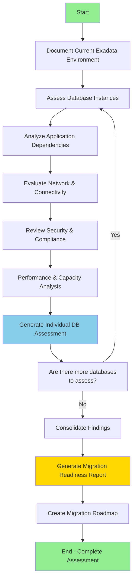
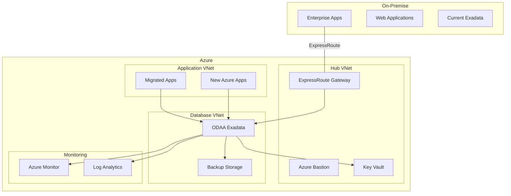
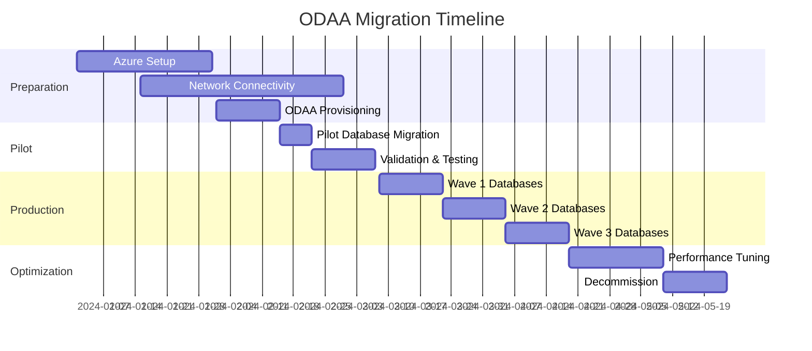

````prompt
# Oracle Database@Azure (ODAA) Exadata Migration Readiness Assessment

## Objective
Assess the readiness of on-premise Oracle Exadata instances and their dependent applications for migration to Oracle Database@Azure Exadata, identifying technical requirements, dependencies, compatibility issues, and migration strategies.

## Context
Oracle Database@Azure (ODAA) provides Oracle Exadata Database Service running natively on Azure infrastructure with direct integration to Azure services. This assessment evaluates the current on-premise Oracle Exadata environment to ensure a successful migration path, considering database architecture, application dependencies, performance requirements, security configurations, and Azure integration opportunities.

## Workflow



### Phase 1: Environment Discovery

#### Task 1: Document Current Exadata Infrastructure

**Information to Gather**:

1. **Exadata Hardware Configuration**
   - Exadata model (X8M, X9M, X10M, etc.)
   - Number of compute nodes
   - Storage servers configuration
   - Total raw storage capacity
   - Flash cache configuration
   - InfiniBand network topology
   - Current capacity utilization (CPU, memory, storage)

2. **Database Deployment Architecture**
   - RAC (Real Application Clusters) configuration
   - Number of RAC instances per database
   - Oracle version and patch level
   - Database consolidation model (CDB/PDB architecture)
   - Number of Container Databases (CDBs)
   - Number of Pluggable Databases (PDBs)
   - Database sizes (allocated vs used space)

3. **Oracle Features in Use**
   - Oracle Enterprise Edition features
   - Active Data Guard configuration
   - Oracle GoldenGate deployments
   - Partitioning implementations
   - Advanced Compression usage
   - In-Memory Database features
   - Exadata-specific features (Storage Indexes, Smart Scan, etc.)
   - Encryption (TDE - Transparent Data Encryption)
   - Oracle Database Vault
   - Oracle Label Security
   - Real Application Security

4. **Licensing Information**
   - Current license model (processor vs named user)
   - Licensed features and options
   - License compliance status
   - BYOL (Bring Your Own License) eligibility

### Phase 2: Individual Database Assessment

For each database identified in Phase 1, perform detailed assessment:

#### Assessment Template: [DATABASE-NAME]

**Status**: [ ] Pending | [x] Completed

##### 1. Database Profile

**Basic Information**:
- **Database Name**: [DB name]
- **Oracle Version**: [e.g., 19.21.0.0.0]
- **Patch Level**: [Current RU/PSU]
- **Database Size**: [Allocated/Used GB]
- **Character Set**: [e.g., AL32UTF8]
- **National Character Set**: [e.g., AL16UTF16]
- **Database Type**: [OLTP/OLAP/Hybrid]
- **Architecture**: [Single Instance/RAC 2-node/RAC 4-node]
- **CDB/PDB**: [Container DB with X PDBs / Standalone]

**Workload Characteristics**:
- **Average transactions/second**: [Number]
- **Peak transactions/second**: [Number]
- **Read/Write ratio**: [Percentage]
- **Batch processing windows**: [Yes/No - Details]
- **Performance SLA requirements**: [Response time, throughput]
- **Planned downtime windows**: [Frequency and duration]

##### 2. Schema and Object Analysis

**Schema Statistics**:
- **Number of schemas**: [Count]
- **Total tables**: [Count]
- **Total indexes**: [Count]
- **Materialized views**: [Count]
- **Database links**: [Count and targets]
- **External tables**: [Count and sources]

**Object Complexity**:
| Object Type | Count | Complexity Notes |
|-------------|-------|------------------|
| Tables | [#] | [Very large tables, partitioned, etc.] |
| Indexes | [#] | [Bitmap, function-based, etc.] |
| Views | [#] | [Complex joins, performance concerns] |
| Packages | [#] | [Business logic complexity] |
| Procedures | [#] | [External dependencies] |
| Functions | [#] | [Java stored procedures] |
| Triggers | [#] | [Complex logic, performance impact] |
| Types | [#] | [Object types, nested tables] |
| Synonyms | [#] | [Cross-database references] |

**Data Distribution**:
- **Largest tables**: [Top 10 with sizes]
- **Growth rate**: [GB/month]
- **Partitioning strategy**: [Range, List, Hash, Composite]
- **Compression**: [OLTP, HCC - Hybrid Columnar Compression]

##### 3. Application Dependencies

**Connected Applications**:
| Application Name | Type | Connection Method | Users | Criticality |
|------------------|------|-------------------|-------|-------------|
| [App 1] | [Web/Batch/Service] | [JDBC/OCI/ODBC] | [Count/Concurrent] | [High/Medium/Low] |
| [App 2] | [Web/Batch/Service] | [JDBC/OCI/ODBC] | [Count/Concurrent] | [High/Medium/Low] |

**Connection Patterns**:
- **Connection pooling**: [Yes/No - Configuration]
- **Connection strings**: [TNS/Easy Connect/LDAP]
- **Load balancing**: [Client-side/Server-side/None]
- **Failover configuration**: [TAF/FCF/Application-managed]
- **Session multiplexing**: [Yes/No]

**Application Technologies**:
| Technology | Version | Notes |
|------------|---------|-------|
| Java | [Version] | [JDBC driver version] |
| .NET | [Version] | [ODP.NET version] |
| Python | [Version] | [cx_Oracle/python-oracledb version] |
| PHP | [Version] | [OCI8 version] |
| Oracle Forms | [Version] | [Migration consideration] |
| Oracle Reports | [Version] | [Migration consideration] |
| APEX | [Version] | [Compatibility check] |

**External Integrations**:
- **ETL Tools**: [Oracle Data Integrator, Informatica, SSIS, etc.]
- **BI Tools**: [Oracle Analytics, Power BI, Tableau, etc.]
- **Reporting Tools**: [Crystal Reports, OBIEE, etc.]
- **Backup Tools**: [RMAN, NetBackup, Commvault, etc.]
- **Monitoring Tools**: [OEM, Datadog, Dynatrace, etc.]

##### 4. High Availability and Disaster Recovery

**Current HA Configuration**:
- **RAC Nodes**: [Number and configuration]
- **Scan Listeners**: [Configuration]
- **Failover time objective**: [Minutes/Seconds]
- **Automatic failover**: [Yes/No]

**Disaster Recovery Setup**:
- **Data Guard configuration**: [Physical/Logical Standby]
- **DR site location**: [Geographic location]
- **Data Guard mode**: [Maximum Performance/Availability/Protection]
- **RPO (Recovery Point Objective)**: [Minutes/Seconds]
- **RTO (Recovery Time Objective)**: [Minutes/Hours]
- **Synchronization lag**: [Current lag time]
- **Switchover frequency**: [Tested frequency]

**Backup Strategy**:
- **Backup type**: [RMAN full/incremental/differential]
- **Backup frequency**: [Daily/Weekly schedule]
- **Retention policy**: [Days/Weeks/Months]
- **Backup destination**: [Disk/Tape/Cloud]
- **Backup compression**: [Yes/No]
- **Backup encryption**: [Yes/No]
- **Recovery testing**: [Frequency and results]
- **Archive log management**: [Deletion policy]

##### 5. Security Configuration

**Authentication**:
- **Authentication method**: [Database/OS/LDAP/Kerberos]
- **Password policy**: [Complexity requirements]
- **External authentication**: [Active Directory integration]
- **Database links authentication**: [Password/Current_user]

**Authorization**:
- **Privilege management**: [Roles and profiles]
- **Least privilege implemented**: [Yes/No - Assessment]
- **Default accounts status**: [Locked/Unlocked]
- **Shared accounts**: [Count and purpose]

**Data Security**:
- **TDE (Transparent Data Encryption)**: [Yes/No - Tablespaces encrypted]
- **TDE Keystore**: [File/HSM/Oracle Key Vault]
- **Column-level encryption**: [Yes/No - Details]
- **Data Masking**: [Implemented/Required]
- **Redaction**: [Yes/No - Policies]
- **Virtual Private Database (VPD)**: [Yes/No - Policies]
- **Database Vault**: [Yes/No - Realms configured]
- **Label Security**: [Yes/No - Policies]

**Network Security**:
- **SQL*Net encryption**: [Yes/No - Algorithm]
- **Certificate-based authentication**: [Yes/No]
- **Firewall rules**: [Database firewall/Network firewall]
- **Allowed IP ranges**: [List of CIDR blocks]
- **VPN requirement**: [Yes/No]

**Audit Configuration**:
- **Audit trail**: [DB/OS/XML/Unified Audit]
- **Unified Audit enabled**: [Yes/No]
- **Audit policies**: [List of policies]
- **Audit retention**: [Days]
- **SIEM integration**: [Tool name]
- **Compliance requirements**: [GDPR/HIPAA/PCI-DSS/SOX/etc.]

##### 6. Performance Analysis

**Database Performance Metrics**:
- **Average CPU utilization**: [Percentage]
- **Peak CPU utilization**: [Percentage]
- **Average memory usage**: [GB]
- **SGA size**: [GB]
- **PGA aggregate target**: [GB]
- **Buffer cache hit ratio**: [Percentage]
- **Library cache hit ratio**: [Percentage]

**Storage Performance**:
- **IOPS (Read)**: [Average/Peak]
- **IOPS (Write)**: [Average/Peak]
- **Throughput (Read)**: [MB/s]
- **Throughput (Write)**: [MB/s]
- **Latency (Read)**: [ms]
- **Latency (Write)**: [ms]
- **Flash cache hit ratio**: [Percentage]
- **Smart Scan efficiency**: [Percentage of eligible scans]

**Top SQL Statements**:
| SQL_ID | Executions/Hour | Avg Elapsed Time | Buffer Gets | Disk Reads | Impact |
|--------|-----------------|------------------|-------------|------------|--------|
| [ID] | [#] | [seconds] | [#] | [#] | [High/Med/Low] |
| [ID] | [#] | [seconds] | [#] | [#] | [High/Med/Low] |

**Wait Events Analysis**:
| Wait Event | Wait Time % | Avg Wait (ms) | Waits/sec | Mitigation |
|------------|-------------|---------------|-----------|------------|
| [Event] | [%] | [#] | [#] | [Strategy] |
| [Event] | [%] | [#] | [#] | [Strategy] |

**Performance Concerns**:
- [Specific performance issue 1]
- [Specific performance issue 2]
- [Bottlenecks identified]

##### 7. Exadata-Specific Features Assessment

**Storage Server Features**:
- **Smart Scan**: [Usage percentage, queries benefiting]
- **Storage Indexes**: [Effectiveness metrics]
- **Hybrid Columnar Compression**: [Tables using HCC, compression ratio]
- **Intelligent Data Placement**: [Yes/No - Configuration]
- **Flash Cache**: [Hit ratio, effectiveness]
- **Write-back Flash Cache**: [Yes/No - Usage]

**Cell Offloading**:
- **Offload eligible queries**: [Percentage]
- **Average offload efficiency**: [Percentage]
- **Cell offload limitations**: [Known issues]

**InfiniBand Network**:
- **Network throughput**: [GB/s]
- **Network latency**: [μs]
- **RDS (Reliable Datagram Sockets)**: [Usage]

##### 8. Database Configuration Parameters

**Critical Init Parameters**:
| Parameter | Current Value | Recommendation | Migration Impact |
|-----------|---------------|----------------|------------------|
| sga_target | [Value] | [Recommendation] | [Impact] |
| pga_aggregate_target | [Value] | [Recommendation] | [Impact] |
| processes | [Value] | [Recommendation] | [Impact] |
| sessions | [Value] | [Recommendation] | [Impact] |
| db_files | [Value] | [Recommendation] | [Impact] |
| open_cursors | [Value] | [Recommendation] | [Impact] |
| parallel_max_servers | [Value] | [Recommendation] | [Impact] |

**Exadata-Specific Parameters**:
- **cell_offload_processing**: [Value]
- **cell_offload_plan_display**: [Value]
- **_serial_direct_read**: [Value]

##### 9. Code Analysis

**PL/SQL Code Assessment**:
- **Invalid objects count**: [Number]
- **Compilation warnings**: [Number]
- **Deprecated features usage**: [List]
- **Operating system interactions**: [UTL_FILE, etc.]
- **External procedures**: [Count and dependencies]
- **Java stored procedures**: [Count and complexity]

**SQL Analysis**:
- **Hard-coded schema names**: [Yes/No - Count]
- **Hard-coded database links**: [Yes/No - Count]
- **Optimizer hints**: [Prevalence and appropriateness]
- **Parallel hints**: [Usage and effectiveness]
- **Direct path operations**: [Insert, Load usage]

**Compatibility Issues**:
- **Features deprecated in target version**: [List]
- **Desupported features**: [List]
- **Required code changes**: [Estimated effort]

##### 10. Data Management

**Data Lifecycle Management**:
- **Partitioning strategy**: [Details]
- **Archive strategy**: [Details]
- **Purge processes**: [Details]
- **ILM policies**: [Automated Data Optimization]
- **Compression strategies**: [Per tablespace/partition]

**Data Movement Requirements**:
- **Data pump exports**: [Frequency and size]
- **Cross-database queries**: [Database links usage]
- **External table usage**: [Frequency and purpose]
- **File system dependencies**: [UTL_FILE directories]

##### 11. Monitoring and Maintenance

**Current Monitoring**:
- **Monitoring tool**: [OEM, Cloud Control, custom]
- **Metrics collected**: [List]
- **Alert thresholds**: [Configuration]
- **Performance baselines**: [Available/Not available]
- **AWR retention**: [Days]
- **Statspack**: [Yes/No]

**Maintenance Activities**:
- **Statistics gathering**: [Frequency and method]
- **Index rebuilds**: [Frequency]
- **Table reorganization**: [Frequency]
- **Patch management**: [Process and frequency]
- **Maintenance windows**: [Frequency and duration]

##### 12. Customization and Extensions

**Custom Solutions**:
- **Custom scripts**: [Count and purpose]
- **Shell scripts**: [Database maintenance, monitoring]
- **Cron jobs**: [Scheduled tasks]
- **Oracle Scheduler jobs**: [Count and types]
- **External jobs**: [Dependencies on OS resources]

**Third-Party Tools**:
- **Performance monitoring**: [Tools]
- **Data modeling**: [Tools]
- **Query tools**: [SQL Developer, Toad, etc.]
- **Change management**: [Tools]

### Phase 3: Network and Connectivity Assessment

#### Network Architecture Analysis

**Current Network Configuration**:
- **Network topology**: [On-premise network design]
- **Database server IP addresses**: [Static/DHCP]
- **VIP (Virtual IP) configuration**: [RAC VIPs]
- **SCAN (Single Client Access Name)**: [Configuration]
- **Listener ports**: [Standard 1521 or custom]
- **Network bandwidth**: [GB/s between tiers]

**Azure Connectivity Planning**:
- **Azure region selection**: [Preferred regions]
- **ExpressRoute requirement**: [Yes/No - Bandwidth needed]
- **VPN configuration**: [Site-to-Site/Point-to-Site]
- **Azure Virtual Network design**: [Address space planning]
- **Subnet configuration**: [Database subnet, application subnet]
- **Network Security Groups**: [Rules required]
- **Latency requirements**: [Max acceptable latency ms]
- **Bandwidth requirements**: [GB/s]

**Client Connectivity Scenarios**:

| Scenario | Current | ODAA Target | Changes Required |
|----------|---------|-------------|------------------|
| On-premise apps to DB | [Direct/VPN] | [ExpressRoute/VPN] | [Connection string, network route] |
| Azure apps to DB | [N/A] | [VNet peering/Private endpoint] | [New Azure integration] |
| Developer access | [VPN/Direct] | [Azure Bastion/VPN] | [Access method change] |
| Batch processing | [Local network] | [Azure network] | [Network path change] |
| Reporting tools | [Direct connection] | [Private endpoint] | [Connection reconfiguration] |

**Name Resolution**:
- **DNS configuration**: [On-premise DNS servers]
- **Database DNS entries**: [SCAN, VIP names]
- **Azure DNS integration**: [Required/Not required]
- **Private DNS zones**: [Configuration needed]

**Firewall and Security**:
- **Current firewall rules**: [Source → Database rules]
- **Azure NSG rules needed**: [List]
- **Database access control lists**: [IP-based restrictions]
- **Service endpoints**: [Required Azure services]
- **Private endpoints**: [For ODAA, Azure Storage, Key Vault]

### Phase 4: Azure Integration Opportunities

#### Native Azure Services Integration

**Identity and Access Management**:
- **Microsoft Entra ID integration**: [Planned/Not planned]
- **LDAP migration to Entra ID**: [Required/Not required]
- **Managed Identity usage**: [For Azure services access]
- **Service Principal authentication**: [Application authentication]
- **Conditional Access policies**: [Database access policies]

**Key Management**:
- **Azure Key Vault for TDE**: [Planned/Not planned]
- **Key rotation strategy**: [Automated/Manual]
- **HSM requirement**: [Premium tier Key Vault]
- **Certificate management**: [For SSL/TLS]

**Monitoring and Logging**:
- **Azure Monitor integration**: [Database metrics]
- **Log Analytics workspace**: [Centralized logging]
- **Application Insights**: [Application performance]
- **Diagnostic settings**: [Logs to collect]
- **Alert rules**: [Critical metrics]
- **Dashboard design**: [Monitoring dashboard]

**Backup and Recovery**:
- **Azure Backup integration**: [ODAA automated backups]
- **Backup to Azure Blob Storage**: [RMAN backups]
- **Cross-region backup replication**: [DR strategy]
- **Long-term retention**: [Compliance requirements]
- **Azure Site Recovery**: [For DR scenario]

**Data Integration Services**:
- **Azure Data Factory**: [ETL/ELT pipelines]
- **Azure Synapse Analytics**: [Data warehousing integration]
- **Azure Databricks**: [Big data analytics]
- **Event Hubs**: [Real-time data streaming]
- **Service Bus**: [Message queuing]

**Analytics and Reporting**:
- **Power BI connectivity**: [Direct Query/Import]
- **Azure Analysis Services**: [OLAP models]
- **Azure ML integration**: [Machine learning workloads]
- **Cognitive Services**: [AI capabilities]

### Phase 5: Compliance and Governance

#### Compliance Requirements

**Regulatory Compliance**:
| Requirement | Current Status | ODAA Capability | Gap Analysis |
|-------------|----------------|-----------------|--------------|
| GDPR | [Compliant/In-progress] | [Supported] | [Actions needed] |
| HIPAA | [Compliant/In-progress] | [Supported] | [Actions needed] |
| PCI-DSS | [Compliant/In-progress] | [Supported] | [Actions needed] |
| SOX | [Compliant/In-progress] | [Supported] | [Actions needed] |
| ISO 27001 | [Compliant/In-progress] | [Supported] | [Actions needed] |

**Data Residency**:
- **Data location requirements**: [Country/Region]
- **Cross-border data transfer**: [Restrictions]
- **Azure region compliance**: [Matching regions]
- **Data sovereignty**: [Requirements]

**Audit and Logging**:
- **Audit log retention**: [Days/Years]
- **Audit log immutability**: [Required/Not required]
- **SIEM integration**: [Azure Sentinel/Third-party]
- **Compliance reporting**: [Frequency and format]
- **Access logs**: [Retention and review process]

#### Governance Framework

**Resource Management**:
- **Azure resource naming convention**: [Standard]
- **Tagging strategy**: [Cost center, environment, owner]
- **Resource groups organization**: [By application/environment]
- **Management groups**: [Enterprise structure]

**Cost Management**:
- **Budget allocation**: [Monthly/Annual]
- **Cost tracking**: [By resource/application]
- **Reserved capacity**: [Commitment level]
- **Cost optimization**: [Right-sizing strategy]
- **Chargeback/Showback**: [Model]

**Change Management**:
- **Change approval process**: [Workflow]
- **Testing requirements**: [Dev/Test/UAT environments]
- **Rollback procedures**: [Strategy]
- **Deployment windows**: [Maintenance windows]

### Phase 6: Migration Strategy

#### Migration Approach Selection

**Migration Methods Evaluation**:

| Method | Downtime | Complexity | Risk | Best For | Selected |
|--------|----------|------------|------|----------|----------|
| Data Pump Export/Import | Hours-Days | Low | Low | Small databases | [ ] |
| RMAN Backup/Restore | Hours | Medium | Low | Medium databases | [ ] |
| Data Guard Physical Standby | Minutes | High | Medium | Large databases, minimal downtime | [ ] |
| GoldenGate Replication | Near-zero | High | Medium | Zero-downtime requirement | [ ] |
| Transportable Tablespaces | Hours | Medium | Medium | Subset of data | [ ] |

**Selected Migration Strategy**: [Method chosen and rationale]

#### Migration Phases

**Phase 1: Pre-Migration (Preparation)**
- [ ] Azure subscription setup
- [ ] Network connectivity establishment (ExpressRoute/VPN)
- [ ] ODAA Exadata infrastructure provisioning
- [ ] Azure Key Vault setup for TDE keys
- [ ] Azure Monitor and Log Analytics workspace configuration
- [ ] Security and compliance validation
- [ ] Migration tools installation and configuration
- [ ] Pilot database selection
- [ ] Backup current environment

**Phase 2: Pilot Migration**
- [ ] Select pilot database (non-critical, representative)
- [ ] Execute pilot migration
- [ ] Application connectivity testing
- [ ] Performance testing and validation
- [ ] Rollback testing
- [ ] Document lessons learned
- [ ] Adjust migration plan based on pilot results

**Phase 3: Production Migration Planning**
- [ ] Database prioritization (criticality, size, complexity)
- [ ] Detailed migration schedule per database
- [ ] Downtime windows approval
- [ ] Rollback procedures definition
- [ ] Communication plan to stakeholders
- [ ] Application team coordination
- [ ] Data validation strategy

**Phase 4: Production Migration Execution**
- [ ] Database-by-database migration per schedule
- [ ] Application cutover coordination
- [ ] DNS/connection string updates
- [ ] Post-migration validation
- [ ] Performance monitoring
- [ ] Issue resolution
- [ ] Hypercare support period

**Phase 5: Post-Migration Optimization**
- [ ] Performance tuning in Azure environment
- [ ] Cost optimization review
- [ ] Azure services integration implementation
- [ ] Monitoring and alerting refinement
- [ ] Documentation updates
- [ ] Training completion
- [ ] Decommission on-premise infrastructure

#### Risk Assessment

**Migration Risks**:

| Risk | Probability | Impact | Mitigation Strategy |
|------|-------------|--------|---------------------|
| Extended downtime | [High/Med/Low] | [High/Med/Low] | [Strategy] |
| Data loss during migration | [High/Med/Low] | [High/Med/Low] | [Strategy] |
| Application compatibility issues | [High/Med/Low] | [High/Med/Low] | [Strategy] |
| Performance degradation | [High/Med/Low] | [High/Med/Low] | [Strategy] |
| Network connectivity issues | [High/Med/Low] | [High/Med/Low] | [Strategy] |
| Security misconfiguration | [High/Med/Low] | [High/Med/Low] | [Strategy] |
| TDE key management issues | [High/Med/Low] | [High/Med/Low] | [Strategy] |
| Cost overrun | [High/Med/Low] | [High/Med/Low] | [Strategy] |

#### Rollback Plan

**Rollback Triggers**:
- [Critical error condition 1]
- [Critical error condition 2]
- [Performance threshold breach]
- [Data integrity issue]

**Rollback Procedure**:
1. [Step 1]
2. [Step 2]
3. [Step 3]
4. [Validation steps]

**Rollback Time Estimate**: [Hours]

### Phase 7: Documentation and Reporting

#### Individual Database Assessment Report

Create a detailed report for each database: `reports/[database-name]-odaa-assessment.md`

**Report Structure**:
```markdown
# ODAA Migration Assessment - [Database Name]

## Executive Summary
[2-3 paragraph overview of database, current state, and migration recommendation]

## Database Profile
[Section 2.1 content]

## Technical Assessment
[Sections 2.2-2.12 consolidated]

## Azure Integration Plan
[Section 4 content]

## Migration Strategy
[Section 6 content]

## Risk Analysis
[Section 6 risks]

## Recommendation
**Migration Readiness**: [Ready/Ready with conditions/Not ready]
**Recommended Migration Method**: [Method]
**Estimated Migration Duration**: [Hours/Days]
**Estimated Downtime**: [Hours]

## Next Steps
1. [Action 1]
2. [Action 2]
3. [Action 3]
```

#### Consolidated Readiness Report

After assessing all databases, create: `odaa-migration-readiness-summary.md`

**Report Structure**:
```markdown
# Oracle Database@Azure Exadata Migration Readiness Summary

## Executive Summary

**Assessment Date**: [Date]
**Current Environment**: Oracle Exadata [Model]
**Total Databases Assessed**: [Number]
**Target Platform**: Oracle Database@Azure Exadata
**Overall Readiness**: [Ready/Conditional/Not Ready]

## Current Environment Overview

### Exadata Infrastructure
[Section 1.1 consolidated]

### Database Inventory

| Database Name | Version | Size (GB) | Type | Criticality | Readiness | Report |
|---------------|---------|-----------|------|-------------|-----------|--------|
| [DB1] | [19c] | [500] | [OLTP] | [High] | [Ready] | [Link] |
| [DB2] | [19c] | [200] | [OLAP] | [Med] | [Ready] | [Link] |

**Total Database Capacity**: [X TB]
**Total Databases**: [Number]
**RAC Databases**: [Number]
**Single Instance Databases**: [Number]

## Technology Stack Summary

### Oracle Features Usage

| Feature | Databases Using | License Requirement | ODAA Support |
|---------|----------------|---------------------|--------------|
| RAC | [Count] | EE | Supported |
| Active Data Guard | [Count] | EE + Option | Supported |
| Partitioning | [Count] | EE + Option | Supported |
| Advanced Compression | [Count] | EE + Option | Supported |
| TDE | [Count] | EE | Supported |
| Database Vault | [Count] | EE + Option | Supported |

### Application Technologies

| Technology | Databases | Applications | Compatibility |
|------------|-----------|--------------|---------------|
| Java/JDBC | [Count] | [Count] | Compatible |
| .NET/ODP.NET | [Count] | [Count] | Compatible |
| Python | [Count] | [Count] | Compatible |

## Azure Target Architecture

### Proposed ODAA Configuration

**ODAA Exadata Shape**: [Recommended configuration]
- **Compute Nodes**: [Number]
- **Storage Servers**: [Number]
- **Total Storage**: [TB]
- **Database Licenses**: [BYOL/Included]

**Azure Region**: [Primary region]
**Availability Zone**: [Configuration]
**Disaster Recovery**: [Secondary region - if applicable]

### Architecture Diagram



### Network Connectivity

**Primary Connectivity**: [ExpressRoute/VPN]
- **Bandwidth**: [Gbps]
- **Expected Latency**: [ms]
- **Redundancy**: [Active-Active/Active-Passive]

**Private Endpoints**:
- ODAA Database Service
- Azure Key Vault
- Azure Storage (for backups)
- Azure Monitor

## Migration Approach

### Recommended Strategy

**Primary Method**: [Data Guard/GoldenGate/RMAN/Data Pump]

**Rationale**: [Explanation of method selection]

### Migration Phases Timeline



### Database Migration Waves

**Wave 1: Low Complexity, Non-Critical** (Target: [Date])
- [Database 1] - [Size] - [Method] - [Downtime estimate]
- [Database 2] - [Size] - [Method] - [Downtime estimate]

**Wave 2: Medium Complexity, Medium Criticality** (Target: [Date])
- [Database 3] - [Size] - [Method] - [Downtime estimate]
- [Database 4] - [Size] - [Method] - [Downtime estimate]

**Wave 3: High Complexity, Mission-Critical** (Target: [Date])
- [Database 5] - [Size] - [Method] - [Downtime estimate]
- [Database 6] - [Size] - [Method] - [Downtime estimate]

## Azure Services Integration

### Identity and Access

- **Microsoft Entra ID**: [Integration plan]
- **Azure Key Vault**: [TDE key management]
- **Managed Identities**: [For Azure service access]
- **Azure RBAC**: [Database access control]

### Monitoring and Management

- **Azure Monitor**: [Database metrics, alerts]
- **Log Analytics**: [Centralized logging]
- **Application Insights**: [Application performance]
- **Workbooks**: [Custom dashboards]

### Backup and DR

- **ODAA Automated Backups**: [Configuration]
- **Azure Backup**: [Long-term retention]
- **Cross-Region Replication**: [DR strategy]
- **Data Guard**: [Standby configuration]

### Data Integration

- **Azure Data Factory**: [ETL pipelines]
- **Azure Synapse**: [Analytics integration]
- **Event Hubs**: [Real-time streaming]
- **Power BI**: [Reporting and analytics]

## Compliance and Security

### Regulatory Compliance Status

| Requirement | Current Status | ODAA Readiness | Actions Required |
|-------------|----------------|----------------|------------------|
| [Regulation 1] | [Status] | [Status] | [Actions] |
| [Regulation 2] | [Status] | [Status] | [Actions] |

### Security Enhancements

- **TDE with Azure Key Vault**: [Implementation plan]
- **Network isolation**: [Private endpoints]
- **Audit logging**: [Azure Monitor integration]
- **Threat detection**: [Azure Defender for SQL]
- **Encryption in transit**: [SSL/TLS enforcement]

## Cost Analysis

### Current On-Premise Costs (Annual)

| Cost Component | Amount |
|----------------|--------|
| Exadata Hardware (amortized) | $[Amount] |
| Oracle Licenses | $[Amount] |
| Maintenance & Support | $[Amount] |
| Data Center (space, power, cooling) | $[Amount] |
| Personnel (DBAs, SysAdmins) | $[Amount] |
| **Total Annual Cost** | **$[Total]** |

### ODAA Projected Costs (Annual)

| Cost Component | Amount |
|----------------|--------|
| ODAA Infrastructure | $[Amount] |
| Oracle Licenses (BYOL/Included) | $[Amount] |
| Azure Networking (ExpressRoute) | $[Amount] |
| Azure Services (Storage, Monitoring) | $[Amount] |
| **Total Annual Cost** | **$[Total]** |

### Cost Comparison

**First Year** (including migration costs): $[Amount]
- Migration Services: $[Amount]
- Parallel Run Period: $[Amount]

**Steady State** (Year 2+): $[Amount]

**3-Year TCO Savings**: $[Amount] ([Percentage]% reduction)

### Cost Optimization Opportunities

- [Reserved capacity commitment]
- [Right-sizing recommendations]
- [Storage optimization]
- [Automation efficiencies]

## Risk Assessment

### Critical Risks

| Risk | Probability | Impact | Mitigation |
|------|-------------|--------|------------|
| [Risk 1] | [H/M/L] | [H/M/L] | [Strategy] |
| [Risk 2] | [H/M/L] | [H/M/L] | [Strategy] |

### Technical Challenges

1. **[Challenge 1]**
   - **Description**: [Details]
   - **Impact**: [Assessment]
   - **Resolution**: [Approach]

2. **[Challenge 2]**
   - **Description**: [Details]
   - **Impact**: [Assessment]
   - **Resolution**: [Approach]

## Readiness Assessment

### Overall Readiness Score

| Category | Weight | Score | Weighted Score |
|----------|--------|-------|----------------|
| Technical Compatibility | 25% | [0-100] | [Score] |
| Network Readiness | 20% | [0-100] | [Score] |
| Application Compatibility | 20% | [0-100] | [Score] |
| Security & Compliance | 15% | [0-100] | [Score] |
| Team Readiness | 10% | [0-100] | [Score] |
| Migration Strategy | 10% | [0-100] | [Score] |
| **Total** | **100%** | - | **[Score]** |

**Readiness Level**: 
- 80-100: ✅ **Ready to Migrate**
- 60-79: ⚠️ **Ready with Conditions**
- 40-59: ⚠️ **Significant Preparation Needed**
- 0-39: ❌ **Not Ready**

**Assessment**: [Overall readiness determination]

### Go/No-Go Criteria

| Criteria | Status | Notes |
|----------|--------|-------|
| Azure subscription ready | [✅/❌] | [Notes] |
| Network connectivity established | [✅/❌] | [Notes] |
| ODAA capacity available | [✅/❌] | [Notes] |
| Licenses verified (BYOL) | [✅/❌] | [Notes] |
| Security requirements met | [✅/❌] | [Notes] |
| Application teams aligned | [✅/❌] | [Notes] |
| Downtime windows approved | [✅/❌] | [Notes] |
| Rollback plan validated | [✅/❌] | [Notes] |

## Recommendations

### Immediate Actions (Pre-Migration)

1. **[Action 1]**
   - **Priority**: [High/Medium/Low]
   - **Owner**: [Team/Person]
   - **Timeline**: [Weeks/Months]
   - **Description**: [Details]

2. **[Action 2]**
   - **Priority**: [High/Medium/Low]
   - **Owner**: [Team/Person]
   - **Timeline**: [Weeks/Months]
   - **Description**: [Details]

### Migration Phase Actions

1. **[Action 1]**
2. **[Action 2]**
3. **[Action 3]**

### Post-Migration Actions

1. **[Action 1]**
2. **[Action 2]**
3. **[Action 3]**

## Conclusion

[Executive summary of findings, recommendations, and expected outcomes]

**Recommended Next Steps**:
1. [Step 1]
2. [Step 2]
3. [Step 3]

**Expected Migration Timeline**: [Months]
**Expected Benefits**: [List key benefits]

## Appendices

- [Individual database assessment reports](./reports/)
- [Network diagrams](./diagrams/network/)
- [Security architecture](./diagrams/security/)
- [Cost analysis spreadsheet](./cost-analysis/)
- [Migration runbooks](./runbooks/)
```

## Execution Instructions

### How to use this prompt:

1. **Initial Environment Discovery**:
   ```
   Prompt: "Analyze the current on-premise Oracle Exadata environment and generate the environment discovery document"
   ```
   - Gather Exadata configuration details
   - Document all database instances
   - Create database inventory

2. **Individual Database Assessment** (repeat for each database):
   ```
   Prompt: "Perform ODAA migration readiness assessment for database [DATABASE-NAME] and generate the report in reports/[database-name]-odaa-assessment.md"
   ```
   - Follow assessment template sections 2.1-2.12
   - Analyze application dependencies
   - Assess migration complexity
   - Document in individual report

3. **Network and Azure Connectivity Assessment**:
   ```
   Prompt: "Assess network connectivity requirements and design Azure network architecture for ODAA migration"
   ```
   - Analyze current network topology
   - Design Azure network architecture
   - Plan ExpressRoute/VPN connectivity

4. **Azure Integration Planning**:
   ```
   Prompt: "Identify Azure services integration opportunities for the ODAA environment"
   ```
   - Plan Azure Key Vault integration
   - Design monitoring strategy
   - Identify data integration services

5. **Final Consolidation**:
   ```
   Prompt: "Consolidate all database assessments and generate the comprehensive ODAA migration readiness summary report"
   ```
   - Review all individual assessments
   - Create consolidated architecture
   - Generate migration timeline
   - Produce final recommendations

## Prerequisites

Before starting the assessment, ensure you have:

- [ ] Access to Oracle Enterprise Manager or monitoring tools
- [ ] AWR/Statspack reports for database performance analysis
- [ ] Access to database servers for configuration review
- [ ] Network diagrams and connectivity documentation
- [ ] Application architecture documentation
- [ ] Current license agreements and usage information
- [ ] Security and compliance requirements documentation
- [ ] Business continuity and disaster recovery plans
- [ ] Azure subscription and appropriate permissions
- [ ] Access to application teams for dependency mapping

## Key Considerations

### Oracle Database@Azure Specific Features

- **Native Oracle Exadata**: Full Exadata stack running in Azure
- **Oracle Direct Integration**: Direct support from Oracle
- **Exadata Features**: All Exadata-specific features supported
- **Low Latency**: Direct Azure backbone connectivity
- **Unified Support**: Joint Microsoft-Oracle support
- **Azure Integration**: Native integration with Azure services
- **BYOL**: Bring Your Own License support
- **Familiar Tools**: Use existing Oracle tools and processes

### Critical Success Factors

1. **Network Connectivity**: Reliable ExpressRoute connectivity
2. **Application Testing**: Thorough application compatibility testing
3. **Performance Validation**: Baseline and post-migration comparison
4. **Security Configuration**: Proper TDE and network security
5. **Team Training**: Azure and ODAA training for DBA team
6. **Change Management**: Stakeholder communication and coordination
7. **Rollback Planning**: Clear rollback procedures for each migration wave

## Expected Deliverables

### Assessment Phase Outputs

```
project/
├── environment-discovery.md              # Current Exadata environment documentation
├── database-inventory.md                 # List of all databases to assess
├── reports/                              # Individual database assessments
│   ├── database1-odaa-assessment.md
│   ├── database2-odaa-assessment.md
│   └── ...
├── diagrams/                             # Architecture and network diagrams
│   ├── current-architecture.png
│   ├── target-azure-architecture.png
│   ├── network-topology.png
│   └── migration-architecture.png
├── cost-analysis/                        # Cost comparison and projections
│   └── odaa-cost-analysis.xlsx
├── runbooks/                             # Migration procedures
│   ├── network-setup-runbook.md
│   ├── database-migration-runbook.md
│   └── application-cutover-runbook.md
└── odaa-migration-readiness-summary.md   # ✅ Final comprehensive report
```

### Documentation Quality Standards

- **Accuracy**: All data validated from actual system queries
- **Completeness**: All sections of templates filled out
- **Clarity**: Technical details explained for non-experts
- **Actionable**: Clear next steps and recommendations
- **Visual**: Diagrams for complex architectures
- **Traceable**: Source of information documented

## Support Resources

### Oracle Database@Azure Documentation
- [Oracle Database@Azure Overview](https://docs.oracle.com/en/cloud/cloud-at-customer/oracle-database-at-azure/)
- [Exadata on Azure Architecture](https://docs.microsoft.com/azure/oracle/)
- [ODAA Deployment Guide](https://docs.oracle.com/en/cloud/cloud-at-customer/oracle-database-at-azure/deployment/)

### Migration Tools and Utilities
- Oracle Data Pump
- Oracle RMAN
- Oracle Data Guard
- Oracle GoldenGate
- Azure Site Recovery (for application tier)

### Azure Services
- Azure ExpressRoute
- Azure Virtual Network
- Azure Key Vault
- Azure Monitor
- Azure Backup

## Contact and Escalation

**Migration Team Contacts**:
- Database Team Lead: [Name/Email]
- Azure Architect: [Name/Email]
- Network Team: [Name/Email]
- Security Team: [Name/Email]
- Application Teams: [Contacts]

**Escalation Path**:
1. Technical Issues: [Contact]
2. Business Decisions: [Contact]
3. Oracle Support: [Support process]
4. Microsoft Support: [Support process]

---

**Document Version**: 1.0
**Last Updated**: [Date]
**Next Review**: [Date]

````
